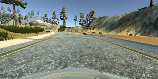
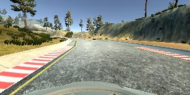
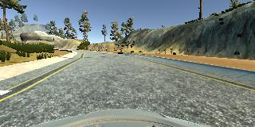
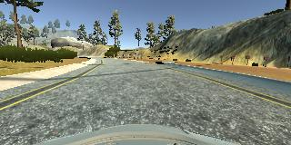
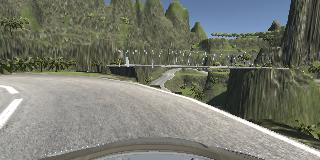
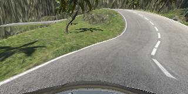
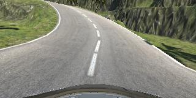
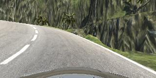

# **Behavioral Cloning** 

## Writeup Template

### You can use this file as a template for your writeup if you want to submit it as a markdown file, but feel free to use some other method and submit a pdf if you prefer.

---

**Behavioral Cloning Project**

The goals / steps of this project are the following:
* Use the simulator to collect data of good driving behavior
* Build, a convolution neural network in Keras that predicts steering angles from images
* Train and validate the model with a training and validation set
* Test that the model successfully drives around track one without leaving the road
* Summarize the results with a written report


## Rubric Points
### Here I will consider the [rubric points](https://review.udacity.com/#!/rubrics/432/view) individually and describe how I addressed each point in my implementation.  

---
### Files Submitted & Code Quality

#### 1. Submission includes all required files and can be used to run the simulator in autonomous mode

My project includes the following files:
* model.py containing the script to create and train the model
* drive.py for driving the car in autonomous mode
* model.h5 containing a trained convolution neural network 
* writeup_report.md summarizing the results

#### 2. Submission includes functional code
Using the Udacity provided simulator and my drive.py file, the car can be driven autonomously around the track by executing:
```sh
python drive.py model.h5
```
And for track two:
```sh
python drive.py cmodel.h5
```

#### 3. Submission code is usable and readable

The model.py file contains the code for training and saving the convolution neural network. The file shows the pipeline I used for training and validating the model, and it contains comments to explain how the code works.

### Model Architecture and Training Strategy

#### 1. An appropriate model architecture has been employed

I used the NVidia self-driving car example model.

#### 2. Attempts to reduce overfitting in the model

The model contains dropout layers in order to reduce overfitting. Also, a large amount of data was collected, which reduced overfitting.

The model was tested by running it through the simulator and ensuring that the vehicle could stay on the track.

#### 3. Model parameter tuning

The model used an adam optimizer, so the learning rate was not tuned manually.

#### 4. Appropriate training data

I recorded 3 laps, a backwards lap, and a lap of recovering from the sides of the road, and wrong car angles.

I repeated this process, for track two.

### Model Architecture and Training Strategy

#### 1. Solution Design Approach

The overall strategy for deriving a model architecture was to try existing methods. LeNet, and the NVidia example self-driving car architecture, and InceptionV3 were tested.

For InceptionV3, transfer learning using frozen ImageNet weights did not work, probably because the ImageNet images aren't similar enough to roads. So I fine tuned it starting with ImageNet weights. At the end of the inception network, I tried two structures:
- A single output (the steering angle)
- A fully connected layer of 512 nodes, followed by a single output (the steering angle)

InceptionV3 and NVidia produced similar results, but NVidia was faster to train, so it was chosen.

I shuffled the data, and separated out 20% to use for validation. 

I briefly used an entire separate lap for validation data, because simply shuffling and randomizing a video would produce correlated training and validation sets. But it turned out not to be a problem in practice, and the lap was too valuable as training data.

The validation loss was more than the training loss, so I added dropout layers. This produced better results.

The final step was to run the simulator to see how well the car was driving around track one. It ran perfectly, after some bug fixes.

I then trained a separate model on track two. Here, the car drove into the oncoming lane, and off the road at various places. I recorded more training data at specifically those spots, and then retrained. This fixed most of the issues, but would still run off the track in one spot. I believe a shadow is confusing the network

At the end of the process, the vehicle is able to drive autonomously around the track without leaving the road on track one, and most of the way on track two.

#### 2. Final Model Architecture

The final model architecture consisted of a convolution neural network with the following layers and layer sizes:

My model consists of the following layers:

| Layer         		|     Description	        					| 
|:---------------------:|:---------------------------------------------:| 
| Input         		| 160x320x3 RGB image   						| 
| Cropping     	        | Crops (70,25),(0,0), outputs 65x320x3 	    |
| Convolution 5x5     	| 2x2 stride, valid padding, outputs 31x158x24 	|
| RELU					|												|
| Convolution 5x5     	| 2x2 stride, valid padding, outputs 14x77x36 	|
| RELU					|												|
| Convolution 5x5     	| 2x2 stride, valid padding, outputs 5x37x48 	|
| RELU					|												|
| Convolution 3x3     	| 1x1 stride, valid padding, outputs 3x35x64 	|
| RELU					|												|
| Convolution 3x3     	| 1x1 stride, valid padding, outputs 1x33x64 	|
| RELU					|												|
| Fully connected		| outputs 100        							|
| RELU					|												|
| Dropout				| keep 50%										|
| Fully connected		| outputs 50        							|
| RELU					|												|
| Dropout				| keep 50%										|
| Fully connected		| outputs 1        							    |

#### 3. Creation of the Training Set & Training Process

To capture good driving behavior, I first recorded three laps on track one using center lane driving. Here is an example image of center lane driving:



I then recorded the vehicle recovering from the left side and right sides of the road back to center so that the vehicle would learn to recover after making a mistake. These images show what a recovery looks like starting from the side of the road:





I also recorded a lap going backwards around the track.

Then I repeated this process on track two, except instead of center lane driving, I drove in the right lane. This data, however, was only used to train the model for track two. Here is an image of right lane driving on track two:



And here is what recovery looks like, starting in the wrong lane, on track two:





To augment the data set, I also flipped images and angles thinking that this would balance the steering angle data, and provide more data to generalize from.

After the collection process, I had X number of data points. I then preprocessed this data by using the InceptionV3 preprocessing function, which is equivalent to (image/256.0 - 0.5).

I finally randomly shuffled the data set and put 20% of the data into a validation set. 

I used this training data for training the model. The validation set helped determine if the model was over or under fitting. The model never overfit, so I never reached the ideal number of epochs. I stopped training after reaching 50 epochs. I used an adam optimizer so that manually training the learning rate wasn't necessary.


Here's a [link to my video result of the car driving autonomously on track one](./writeup_files/run.mp4)

Here's a [link to my video result of the car driving autonomously on track two](./writeup_files/crun.mp4)
